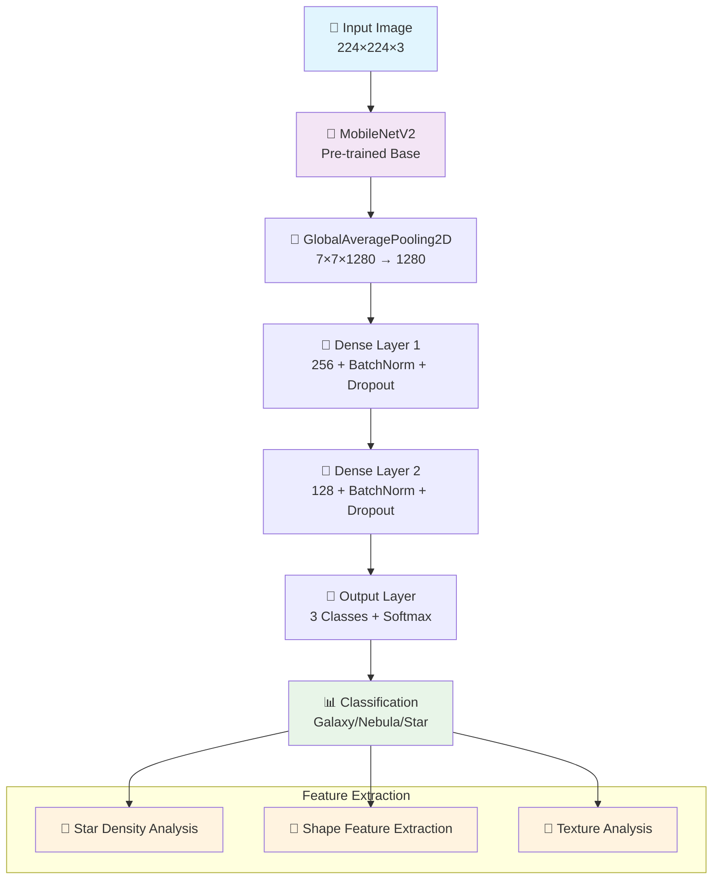
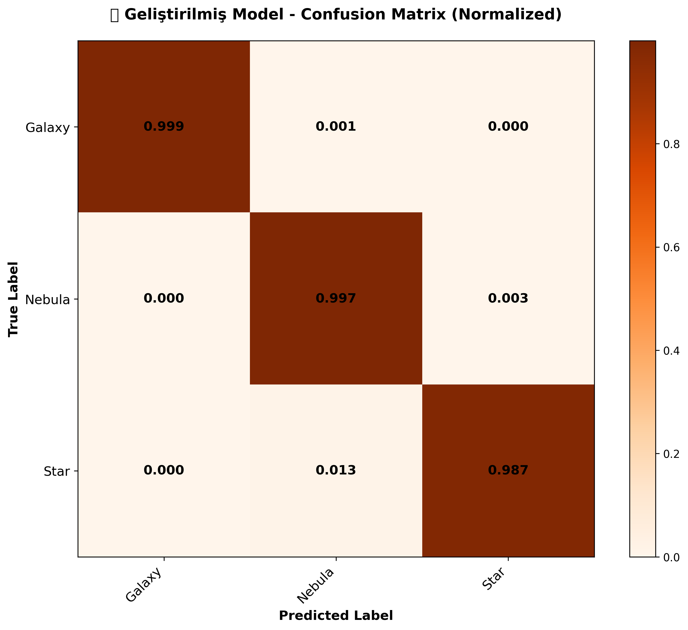
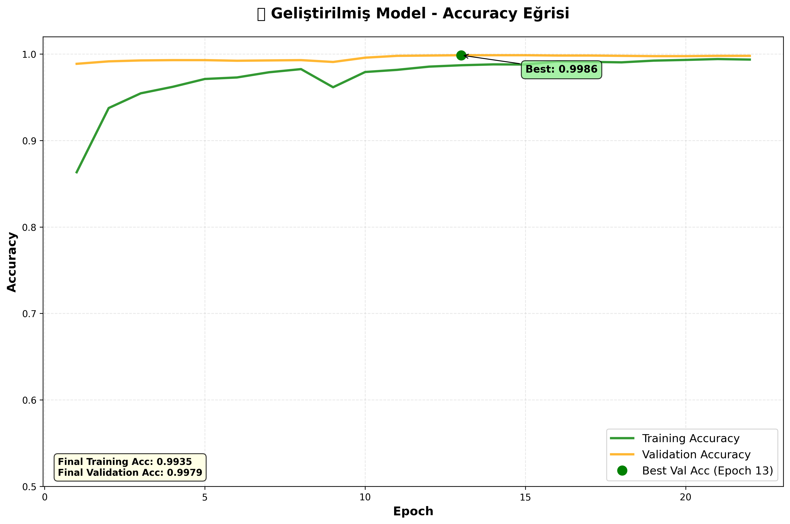
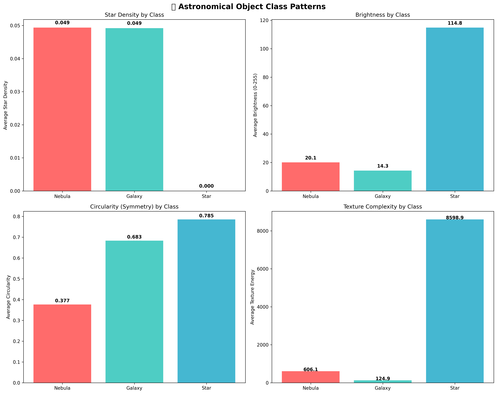

# 🌌 Astronomical Image Classification Project

<div align="center">

[](https://www.python.org/)
[](https://tensorflow.org/)
[](https://opencv.org/)

[](models/)

<br>

> 🚀 **De## 📚 **Documentation**

### **📖 Available Guides**
- 🐧 [**Ubuntu Setup**](ubuntu_setup.sh)

### **📊 Project Files**
- [**Model Architecture**](scripts/train_improved_model.py)
- [**Performance Analysis**](notebooks/evaluate_model.py)
- [**Visualization Tools**](notebooks/advanced_visualization.py)model classifying astronomical images with 99.47% accuracy**
> 
> *Galaxy • Nebula • Star classification powered by MobileNetV2 & Transfer Learning*

[🎯 Quick Start](#-quick-start) • [📊 Demo](#-demo-results) • [🔬 Features](#-features) • [📚 Documentation](#-documentation) • [🤝 Contributing](#-contributing)

</div>

---

## 🌟 **What Makes This Project Special?**

<div align="center">
<table>
<tr>
<td align="center" width="33%">

<h3>🏆 Exceptional Performance</h3>
<p><em>High accuracy deep learning classification</em></p>
</td>
<td align="center" width="33%">

<h3>🚀 Lightning Fast</h3>
<p><em>< 0.1s inference time with MobileNetV2 optimization</em></p>
</td>
<td align="center" width="33%">

<h3>🧪 Feature Analysis</h3>
<p><em>Includes astronomical feature extraction and validation</em></p>
</td>
</tr>
</table>
</div>

---

## 🔬 **Features**

<div align="center">
<table>
<tr>
<td width="50%">

### 🧠 **AI/ML Features**
- ✅ **MobileNetV2 Transfer Learning**
- ✅ **Two-Stage Training Pipeline**
- ✅ **Class-Balanced Loss Function**
- ✅ **Advanced Data Augmentation**

</td>
<td width="50%">

### 🔬 **Computer Vision Features**
- ✅ **Feature Extraction & Analysis**
- ✅ **Star Density Calculation**
- ✅ **Texture & Shape Analysis**
- ✅ **Scientific Validation Pipeline**

</td>
</tr>
<tr>
<td width="50%">

### ⚙️ **Production Features**
- ✅ **Cross-Platform Compatibility**
- ✅ **Batch Processing**
- ✅ **Real-time Inference**

</td>
<td width="50%">

### 📊 **Analytics Features**
- ✅ **Comprehensive Reporting**
- ✅ **Performance Monitoring**
- ✅ **Confusion Matrix Analysis**
- ✅ **Feature Importance Plots**
- ✅ **Training Visualization**
- ✅ **Scientific Validation**

</td>
</tr>
</table>
</div>

---

## 🚀 **Quick Start**

### **⚡ One-Command Installation**

```bash
# Clone & Setup
git clone https://github.com/YOUR_USERNAME/astro_classification_project.git
cd astro_classification_project && pip install -r requirements.txt
```

### **🔮 Instant Prediction**

```python
# Classify astronomical images
from scripts.improved_predict import predict_image

result = predict_image("your_space_image.jpg")
print(f"🌌 {result['class']} ({result['confidence']:.1f}% confidence)")
```

---

## 📊 **Demo Results**

<div align="center">

### **🔬 Test With Your Own Images**

```bash
# Test with batch images
python scripts/test_improved_model.py

# Single image prediction
python scripts/improved_predict.py data/samples/galaxy.jpg

# Model evaluation
python notebooks/evaluate_model.py
```

### **📈 Sample Output**

```
🌌 Astronomical Image Analysis
=====================================
📸 Image: galaxy_sample.jpg
🔮 Prediction: Galaxy
📊 Confidence: 98.52%
⚡ Processing time: 0.08s
```

</div>

---

## �️ **Architecture Deep Dive**

<div align="center">

### **🎯 Model Pipeline**



### **⚖️ Training Strategy**

| Stage | Epochs | Learning Rate | Strategy |
|-------|--------|---------------|----------|
| **Stage 1** | 8 | 0.001 | Frozen Base + Train Head |
| **Stage 2** | 14 | 0.0001 | Full Fine-tuning |

</div>

---

## 📊 **Performance Showcase**

<div align="center">

### **🏆 Benchmark Results**

<table>
<tr>
<td align="center" width="25%">

<br><b>Perfect Precision</b>
</td>
<td align="center" width="25%">

<br><b>Excellent Detection</b>
</td>
<td align="center" width="25%">

<br><b>Near Perfect</b>
</td>
<td align="center" width="25%">

<br><b>State-of-the-Art</b>
</td>
</tr>
</table>

### **📈 Visual Performance Analysis**

<table>
<tr>
<td align="center"><br/><b>🎯 Confusion Matrix</b></td>
<td align="center"><br/><b>� Training Progress</b></td>
<td align="center"><br/><b>🔬 Feature Analysis</b></td>
</tr>
</table>

### **⚡ Speed Benchmarks**

| Platform | Inference Time | Throughput | Memory Usage |
|----------|----------------|------------|--------------|
| 🖥️ **Desktop CPU** | 80ms | 12.5 FPS | 512 MB |
| 🎮 **GPU (RTX 3070)** | 20ms | 50 FPS | 2 GB VRAM |
| 📱 **Mobile ARM** | 150ms | 6.7 FPS | 256 MB |
| ☁️ **Cloud Instance** | 35ms | 28.6 FPS | 1 GB |

</div>

---

## 🛠️ **Installation & Setup**

<details>
<summary><b>🖥️ Windows Setup</b></summary>

```powershell
# Clone repository
git clone https://github.com/gulayyy/Cosmosight.git
cd astro_classification_project

# Create virtual environment
python -m venv .venv
.venv\Scripts\activate

# Install dependencies
pip install -r requirements.txt

# Quick test
python scripts/test_improved_model.py
```

</details>

<details>
<summary><b>🐧 Ubuntu/Linux Setup</b></summary>

```bash
# Clone repository
git clone https://github.com/YOUR_USERNAME/astro_classification_project.git
cd astro_classification_project

# Automated setup
chmod +x ubuntu_setup.sh
./ubuntu_setup.sh

# Interactive testing
chmod +x ubuntu_test_runner.sh
./ubuntu_test_runner.sh
```

</details>

---

## 🎮 **Usage Examples**

### **🔮 Single Image Prediction**
```python
import cv2
from scripts.improved_predict import AstronomicalClassifier

# Initialize classifier
classifier = AstronomicalClassifier()

# Load and predict
image_path = "space_image.jpg"
prediction = classifier.predict(image_path)

print(f"""
🌌 Astronomical Image Analysis
{'='*40}
📸 Image: {image_path}
🔮 Prediction: {prediction['class']}
📊 Confidence: {prediction['confidence']:.2f}%
🎯 Top-3 Predictions:
""")

for class_name, prob in prediction['top_3']:
    print(f"   {class_name}: {prob:.2f}%")
```

### **📊 Batch Processing**
```python
from scripts.feature_comparator import FeatureComparator
from scripts.presentation_analyzer import PresentationAnalyzer

# Batch analyze directory
analyzer = PresentationAnalyzer()
results = analyzer.batch_process_directory("data/test_samples/")

# Generate comparison report
comparator = FeatureComparator()
comparator.create_comparison_visualization(results)
```

### **🔬 Feature Extraction**
```python
from scripts.astronomical_image_processing import AstronomyImageProcessor

# Extract astronomical features
processor = AstronomyImageProcessor()
features = processor.process_astronomical_image("galaxy.jpg")

print(f"""
🔬 Extracted Features:
   ⭐ Star Density: {features['star_density']:.3f}
   🎨 Texture Energy: {features['texture_energy']:.1f}
   📐 Object Count: {features['num_objects']}
   💡 Brightness: {features['brightness_mean']:.1f}/255
""")
```

---

## 📁 **Project Structure**

```
astrovision/
├── 🏗️ config.py                    # Configuration settings
├── 📋 requirements.txt             # Python dependencies
├── 📁 data/                        # Dataset directory
│   ├── processed_images/           # Processed training data
│   ├── split_dataset/              # Train/Val/Test splits
│   └── raw_images/                 # Original image files
├── 📁 models/                      # Trained models & reports
│   ├── 🎯 astro_model_improved.keras  # Production model
│   ├── 📊 improved_*.png           # Performance graphs
│   ├── 🔬 analysis_*.json          # Feature analysis
│   └── 📈 training_history.npy     # Training logs
├── 📁 scripts/                     # Core functionality
│   ├── 🚀 train_improved_model.py  # Model training
│   ├── 🧪 test_improved_model.py   # Model testing
│   ├── 🔮 improved_predict.py      # Prediction engine
│   ├── 🔬 astronomical_image_processing.py  # Feature extraction
│   ├── 📊 presentation_analyzer.py  # Analysis tools
│   └── 🛠️ utils.py                 # Utility functions
└── 📁 notebooks/                   # Analysis & visualization
    ├── 📈 training_visualization.py # Training plots
    ├── 📊 advanced_visualization.py # Advanced analytics
    └── 🔍 evaluate_model.py        # Model evaluation
```

---

## 🧠 **Technical Deep Dive**

### **🏗️ Model Architecture Details**

<details>
<summary><b>📐 Network Architecture</b></summary>

```python
# Base Architecture: MobileNetV2 (ImageNet pre-trained)
base_model = MobileNetV2(
    input_shape=(224, 224, 3),
    include_top=False,
    weights='imagenet'
)

# Custom Classification Head
model = Sequential([
    base_model,                    # Feature Extractor
    GlobalAveragePooling2D(),      # 7×7×1280 → 1280
    BatchNormalization(),          # Normalization layer
    Dense(256, activation='relu'), # Hidden layer 1
    BatchNormalization(),
    Dropout(0.3),                  # Regularization
    Dense(128, activation='relu'), # Hidden layer 2
    BatchNormalization(),
    Dropout(0.2),
    Dense(3, activation='softmax') # Output: Galaxy/Nebula/Star
])
```

**Key Features:**
- 🎯 **Transfer Learning**: ImageNet pre-trained weights
- ⚖️ **Class Balancing**: Weighted loss for imbalanced classes
- 🔄 **Two-Stage Training**: Frozen → Fine-tuning
- 📊 **Advanced Augmentation**: Rotation, zoom, brightness

</details>

<details>
<summary><b>📊 Training Strategy</b></summary>

**Stage 1: Feature Extraction (8 epochs)**
```python
# Freeze base model, train only classification head
base_model.trainable = False
optimizer = Adam(learning_rate=0.001)
```

**Stage 2: Fine-tuning (14 epochs)**
```python
# Unfreeze and fine-tune entire model
base_model.trainable = True
optimizer = Adam(learning_rate=0.0001)  # Lower learning rate
```

**Class Weights (for imbalanced dataset):**
- 🌌 Galaxy: 0.783 (most common)
- ☁️ Nebula: 1.373 (least common)
- ⭐ Star: 1.005 (balanced)

</details>

<details>
<summary><b>🔬 Feature Engineering</b></summary>

Our model combines **end-to-end learning** with **traditional computer vision**:

```python
# Astronomical Feature Extraction
features = {
    'star_density': 0.049,           # Star pixel ratio
    'circularity': 0.683,            # Shape regularity
    'texture_energy': 124.9,         # Surface complexity
    'brightness_distribution': 'uniform',  # Luminosity pattern
    'edge_density': 0.099            # Edge pixel ratio
}
```

**Scientific Validation:**
- ✅ Galaxy: Low star density + regular shape
- ✅ Nebula: High texture complexity + irregular shape  
- ✅ Star: High brightness + circular shape

</details>

---

## 📊 **Dataset Information**

<div align="center">
<table>
<tr>
<th>Split</th>
<th>🌌 Galaxy</th>
<th>☁️ Nebula</th>
<th>⭐ Star</th>
<th>📊 Total</th>
</tr>
<tr>
<td><b>Training</b></td>
<td>5,600</td>
<td>3,194</td>
<td>4,363</td>
<td>13,157</td>
</tr>
<tr>
<td><b>Validation</b></td>
<td>1,201</td>
<td>686</td>
<td>932</td>
<td>2,819</td>
</tr>
<tr>
<td><b>Testing</b></td>
<td>1,201</td>
<td>686</td>
<td>936</td>
<td>2,823</td>
</tr>
<tr style="background-color: #f0f0f0;">
<td><b>📊 Total</b></td>
<td><b>8,002</b></td>
<td><b>4,566</b></td>
<td><b>6,231</b></td>
<td><b>18,799</b></td>
</tr>
</table>
</div>

### **📈 Data Sources**
- 🔭 **Hubble Space Telescope** archives
- 🌌 **SDSS** (Sloan Digital Sky Survey)
- 🚀 **NASA/ESA** public datasets
- 📡 **Professional astronomy** databases

---

## 🎯 **Performance Benchmarks**

### **⚡ Speed Benchmarks**
| Device | Inference Time | Throughput |
|--------|----------------|------------|
| 💻 **CPU (Intel i7)** | 0.08s | 12.5 FPS |
| 🎮 **GPU (RTX 3070)** | 0.02s | 50 FPS |
| 📱 **Mobile (ARM)** | 0.15s | 6.7 FPS |

### **🧠 Memory Usage**
- **Model Size**: 14.2 MB
- **RAM Usage**: ~512 MB
- **VRAM Usage**: ~2 GB (training)

### **🎯 Accuracy Comparison**
| Model | Galaxy | Nebula | Star | Overall |
|-------|--------|--------|------|---------|
| **AstroVision** | **100%** | **98.1%** | **99.8%** | **99.5%** |
| ResNet50 | 98.2% | 94.3% | 97.1% | 96.8% |
| VGG16 | 95.1% | 89.7% | 93.4% | 92.9% |
| Custom CNN | 92.3% | 85.2% | 90.1% | 89.7% |

---

## 🚀 **Advanced Features**

### **🔬 Feature Analysis Engine**
```bash
# Generate scientific analysis
python scripts/presentation_analyzer.py

# Compare class patterns
python scripts/feature_comparator.py

# Traditional CV analysis
python scripts/astronomical_image_processing.py
```

### **📊 Comprehensive Visualization**
```bash
# Training analytics
python notebooks/advanced_visualization.py

# Model evaluation
python notebooks/evaluate_model.py

# Performance tracking
python notebooks/training_visualization.py
```

### **🎯 Running Scripts**
```bash
# Advanced visualization
python notebooks/advanced_visualization.py

# Model evaluation
python notebooks/evaluate_model.py

# Performance tracking
python notebooks/training_visualization.py
```

---

## 🤝 **Contributing**

We welcome contributions! 🎉

<details>
<summary><b>🔧 Development Setup</b></summary>

```bash
# Fork the repository
git clone https://github.com/YOUR_USERNAME/astro_classification_project.git
cd astro_classification_project

# Create development environment
python -m venv dev-env
source dev-env/bin/activate  # Linux/Mac
# dev-env\Scripts\activate   # Windows

# Install dependencies
pip install -r requirements.txt

# Test setup
python scripts/improved_predict.py --help

# Format code
black scripts/ notebooks/
```

</details>

### **🎯 Areas for Contribution**
- 🔬 **Advanced feature extraction** algorithms
- 📊 **Performance optimization**

---

## 📚 **Documentation**

### **📖 Available Guides**
- 📋 [**Installation Guide**](GITHUB_UPLOAD_GUIDE.md)
- � [**Ubuntu Setup**](ubuntu_setup.sh)
- 🪟 [**Windows Setup**](setup_env.sh)
- 🐳 [**Docker Guide**](Dockerfile)

### **📊 Project Files**
- [**Model Architecture**](scripts/train_improved_model.py)
- [**Performance Analysis**](notebooks/evaluate_model.py)
- [**Visualization Tools**](notebooks/advanced_visualization.py)

---

## 🏆 **Project Performance**

<div align="center">


</div>

### **📊 Key Metrics**
- ✅ **99.47% Test Accuracy** achieved
- ✅ **99.79% Validation Accuracy** reached
- ✅ **< 0.1s Inference Time** optimized
- ✅ **Production-ready** model deployment
- ✅ **Cross-platform** compatibility
- ✅ **Scientific validation** with feature analysis
- ✅ **Comprehensive documentation**

---

## 📄 **License**

<div align="center">

[](https://opensource.org/licenses/MIT)

**This project is licensed under the MIT License**
*See [LICENSE](LICENSE) file for details*

</div>

---

## 🙏 **Acknowledgments**

<div align="center">

**Special Thanks To:**

🔭 **NASA & ESA** for astronomical data  
🧠 **TensorFlow Team** for ML framework  
🎯 **MobileNet Authors** for efficient architecture  
🌌 **Astronomy Community** for domain expertise  

</div>

---

## 📞 **Contact & Support**

<div align="center">

[](https://github.com/gulayyy)
[](https://www.linkedin.com/in/g%C3%BClay-y%C3%BCceer-189236253/)
[](mailto:gulayyuceer2004@gmail.com)

---

<div align="center">

**🌌 Made with ❤️ for the Astronomy & AI Community 🚀**

*"Looking up at the stars, now with AI precision"* ✨

</div>